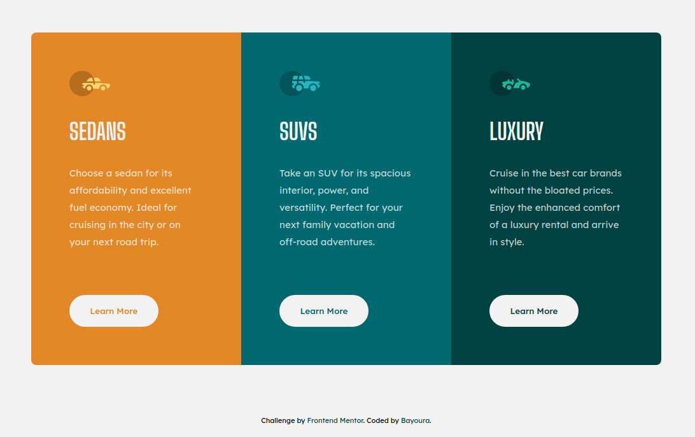

# Frontend Mentor - 3-column preview card component solution 

This is a solution to the [3-column preview card component challenge on Frontend Mentor](https://www.frontendmentor.io/challenges/3column-preview-card-component-pH92eAR2-). Frontend Mentor challenges help you improve your coding skills by building realistic projects. 

## Table of contents

- [Overview](#overview)
  - [The challenge](#the-challenge)
  - [Screenshot of my result](#screenshot-of-my-result)
  - [Links](#links)
- [My process](#my-process)
  - [Built with](#built-with)
  - [What I learned](#what-i-learned)
  - [Continued development](#continued-development)
- [Author](#author)

## Overview

### The challenge

Users should be able to:

- View the optimal layout depending on their device's screen size
- See hover states for interactive elements

### Screenshot of my result

### Links

- [View Code](https://github.com/Bayoura/3-column-preview-card-component)
- [Live Demo](https://bayoura.github.io/3-column-preview-card-component/)

## My process

### Built with

- HTML
- CSS
- Flexbox
- Mobile-first workflow

### What I learned

While working on this project, I researched more about HTML tags, in particular `<section>` and `<article>`. You shouldn't just always use the `
` tag to wrap content. While that may be the best option in some cases, in many other there are better suited tags. Using other tags also has many benefits; mainly better readability and accessibility. Screen readers use tags and specific landmarks (main, header etc.) to navigate the site. If there are only divs all over the place, users that are dependent on assistive technologies will have a hard time accessing the site. Good semantics are important!  
Overall, this project was fairly easy.

### Continued development

I want to learn more about accessible design.

## Author

- [codepen](https://codepen.io/bayoura)
- [GitHub](https://github.com/Bayoura)
- [Frontend Mentor](https://www.frontendmentor.io/profile/Bayoura)
